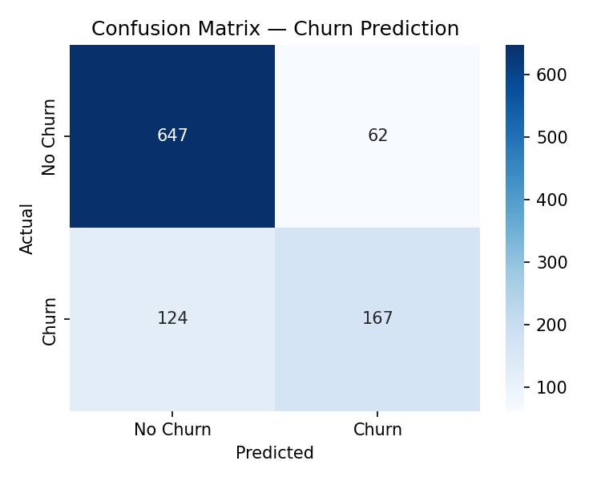
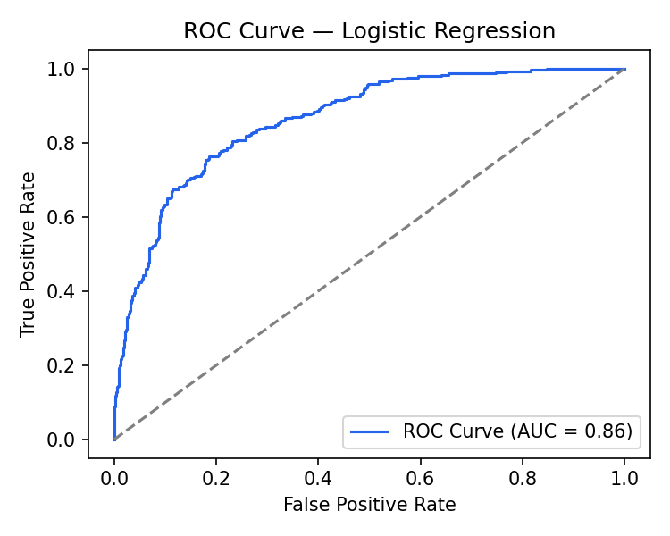
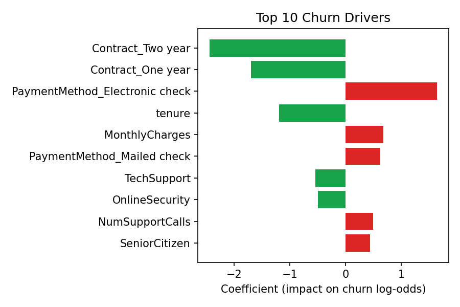

# Customer Churn Prediction & Sales Dashboard

Predicts customer churn using Logistic Regression (scikit-learn) and visualizes churn trends, customer segments, and model insights in an interactive Power BI dashboard.

## Overview

This project simulates a telecom-style customer base and builds an end-to-end churn analytics pipeline:

1. **Data preprocessing & feature engineering** — cleaning, encoding categorical variables, scaling numeric features using Pandas and NumPy
2. **Predictive modeling** — Logistic Regression classifier built with scikit-learn to flag customers likely to churn
3. **Model evaluation** — accuracy, precision, recall, F1, ROC-AUC, and confusion matrix analysis
4. **Interactive Power BI dashboard** — churn trends, customer segments, and model-driven risk scoring using DAX measures, built on the model's output

## Results

| Metric | Score |
|---|---|
| Accuracy | **81.4%** |
| Precision | 72.9% |
| Recall | 57.4% |
| F1 Score | 64.2% |
| ROC AUC | 86.4% |




## Top Churn Drivers

Identified via model coefficients:



- **Contract type** — month-to-month customers churn far more than one/two-year contract holders
- **Payment method** — customers paying by electronic check show higher churn risk
- **Tenure** — longer-tenured customers are significantly less likely to churn
- **Support interactions** — customers without tech support / online security churn more
- **Monthly charges** — higher bills correlate with higher churn risk

## Tech Stack

- **Python** — Pandas, NumPy for data preprocessing and feature engineering
- **Scikit-learn** — Logistic Regression model, train/test split, evaluation metrics
- **Matplotlib / Seaborn** — model evaluation visualizations
- **Power BI** — interactive dashboard with DAX measures for churn segmentation

## Project Structure

```
customer-churn-prediction/
├── data/
│   └── customer_churn_data.csv       # Raw customer dataset
├── src/
│   ├── generate_data.py              # Dataset generation
│   └── churn_model.py                # Preprocessing, training, evaluation
├── dashboard/
│   ├── churn_scored_for_powerbi.csv  # Model output, ready for Power BI
│   ├── confusion_matrix.png
│   ├── roc_curve.png
│   ├── feature_importance.png
│   ├── feature_importance.csv
│   └── model_metrics.txt
├── POWER_BI_GUIDE.md                 # Step-by-step dashboard build guide
├── requirements.txt
└── README.md
```

## How to Run

```bash
pip install -r requirements.txt
python src/generate_data.py      # generates data/customer_churn_data.csv
python src/churn_model.py        # trains model, prints metrics, exports dashboard files
```

## Power BI Dashboard

See [POWER_BI_GUIDE.md](POWER_BI_GUIDE.md) for the full walkthrough — DAX measures, visuals, and layout — using `dashboard/churn_scored_for_powerbi.csv` as the data source.

## Author

Stuti Maheska — Integrated M.Sc, NIT Durgapur
